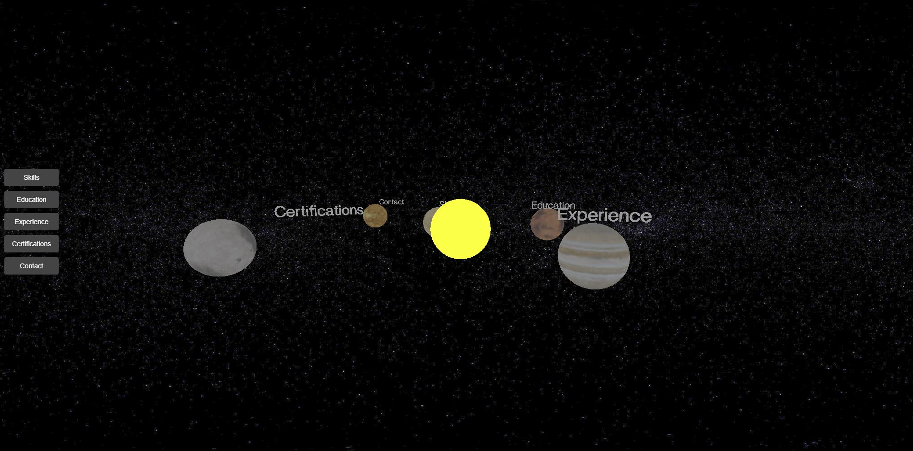

# 🌌 Three.js Interactive CV

This project is a 3D, interactive curriculum vitae built using **Three.js** and **Vite**. It presents your skills, experience, education, certifications, and contact information as orbiting planets around a central sun in a space-themed environment.

---

## 🚀 Features

- 🪐 **Planet-based Navigation**: Each CV section is represented as a rotating textured planet.
- 🛰 **Floating Labels**: Dynamic 3D text hovers above each planet, always facing the camera.
- 🖱 **Click Interaction**: Clicking a planet opens a panel in front of the camera with details.
- ❌ **Close Button**: A flat "X" button allows you to dismiss open panels.
- 🌌 **Immersive Visuals**: Starfield background, rotating orbits, and polished textures.
- 🧭 **Camera Control**: `OrbitControls` lets users explore the solar system-like CV.

---

## 🛠 Technologies Used

- [Three.js](https://threejs.org/) for 3D rendering
- [Vite](https://vitejs.dev/) for fast module bundling and dev server
- [OrbitControls](https://threejs.org/docs/#examples/en/controls/OrbitControls)
- [TextGeometry](https://threejs.org/docs/#examples/en/geometries/TextGeometry)
- [Jest](https://jestjs.io/) for testing (mocked Three.js + WebGL setup)

---

## 📁 Folder Structure (Modular)

```
├── public/
│   └── textures/              # Background and planet surface textures
├── src/
│   ├── main.js                # App entry point
│   ├── animate.js             # Animation loop
│   ├── style.css              # Canvas styling
│   ├── interaction/
│   │   └── onClickHandler.js  # Raycasting + interaction logic
│   └── scene/
│       ├── initScene.js       # Sets up camera, renderer, controls
│       ├── addSun.js          # Adds central sun mesh
│       ├── planets.js         # Creates orbiting planet meshes
│       ├── labels.js          # Loads font & generates floating 3D text
│       └── panels.js          # Info panel and close button creation
├── __tests__/
│   └── createScene.test.js    # Unit tests for scene creation
├── index.html                 # App shell
├── package.json               # Dependencies & scripts
└── README.md                  # You're here
```

---

## 🧪 Testing

Tests are written using Jest and focus on verifying:
- Scene, camera, and renderer instantiation
- Mocked WebGL context and DOM elements
- Module structure through `createScene.js`

---

## ⚙️ Setup Instructions

### 1. Install dependencies

```bash
npm install
```

### 2. Start the dev server

```bash
npm run dev
```

> This uses Vite, and runs on `http://localhost:5173`

### 3. Run tests

```bash
npm test
```

---

## 🧠 Motivation

This project was built as a creative and interactive frontend portfolio. It demonstrates spatial UI, Three.js skills, modular JavaScript architecture, and modern tooling — ideal for roles in immersive or interactive development.

---

## 📸 Screenshot



---

## ✍️ Author

**Dimitrios Zafeiropoulos**  
📧 dzaf96@gmail.com  
🔗 [LinkedIn](https://linkedin.com/in/dimitris-zafeiropoulos)
